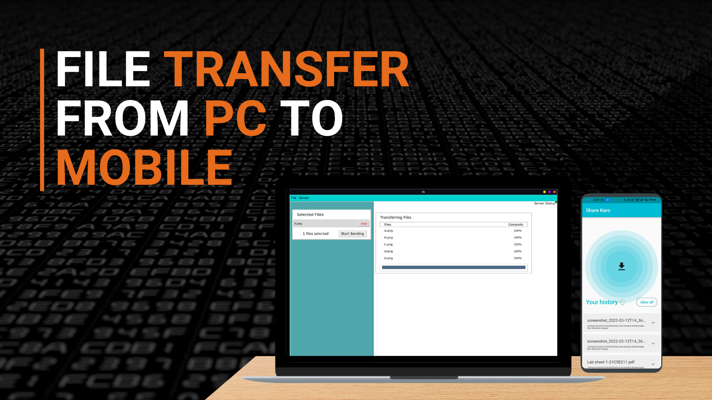
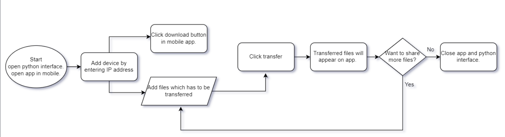
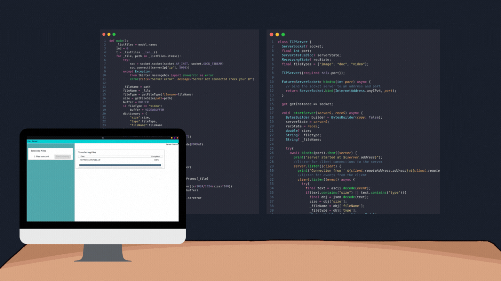

</a>

**<h1 align="center">Share Karo 📩</h1>**

A File Transfer Application Using Socket Programming

## Introduction 🧐

- A socket is one endpoint of a two way communication link between two programs running on the network. 
- The socket provides a bidirectional FIFO Communication facility over the network.
- Each socket has a specific address. This address is composed of an IP address and a port number.
- Socket are generally employed in client server applications. 
- The server creates a socket, attaches it to a network port addresses then waits for the client to contact it. 
- The client creates a socket and then attempts to connect to the server socket. When the connection is established, transfer of data takes place.

### Terminology 💭

> **Create()** : Create's a Socket

> **Bind()** : Binds a unique local name to the Socket

> **Listen()** : Ready to receive a Connection 

> **Connect()** : Ready to act as a Sender 

> **Accept()** : Server to accept a Connection request from a Client

> **Write()** : Write's data on a Socket

> **Read()** : Read's data on a Socket

> **Close()** : Close's a Connection

### Flow Chart 📈

### Chronology ♻️

## Results 😎

### **Try it out** 🥵
➡️ Download the Mobile version >> [Mobile 📱](https://drive.google.com/file/d/11vXA-3gqD0ae5CFGUoNGptK6qzSnRRts/view?usp=sharing)

➡️ Download the Desktop version >> [Desktop 🖥️](https://drive.google.com/file/d/18Oy0QZUskM1HQ2T1MgeWaLVMjBVqUsRy/view?usp=sharing)

### Team Members 😄
- [Bhupathi Shwejan Raj](https://github.com/shwejanraj)
- [Bolisetty Sujith](https://bolisettysujith.rocks)
- [Janagama Vamshi Krishna](https://github.com/vamshijanagama)

**
# Happy Coding #
**
